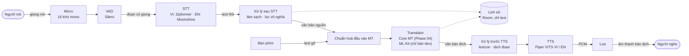
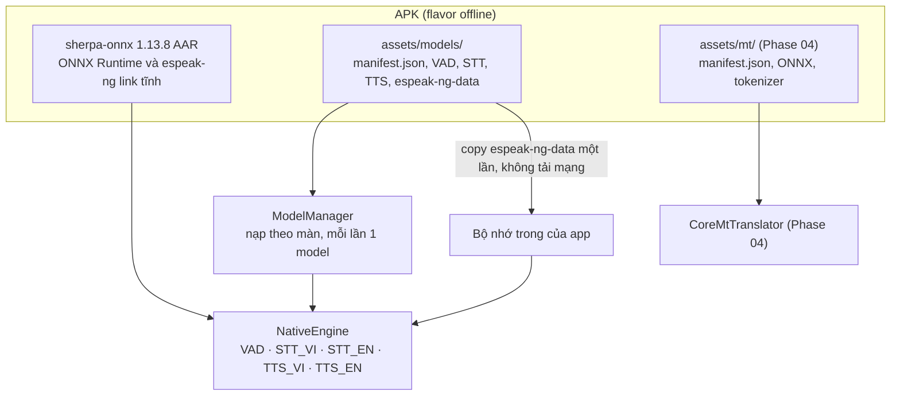

# Kiến trúc AppProduct

Tài liệu này mô tả thiết kế sẽ code ở giai đoạn A (khung app, STT, TTS, hội
thoại, lịch sử). Bố cục theo mục 3.1 của dàn ý báo cáo
(`Documents/suggest báo cáo.docx`: người dùng → STT → MT → TTS → người dùng,
cùng model storage, runtime offline và xử lý lỗi) để dùng lại cho chương 3.

## 1. Luồng chính

- Chiều dịch luôn chọn rõ: hai nút "Việt → Anh" / "Anh → Việt" ở màn Dịch; mỗi
  người một nút nói theo ngôn ngữ của mình ở màn Hội thoại. Không tự nhận diện
  ngôn ngữ.
- Bản offline khi chưa có gói MT: không có bộ dịch, hiện banner "Chưa có mô hình
  dịch offline (Phase 04)" và chỉ hiện câu gốc. Không tạo bản dịch giả. (Gói MT
  có thể là Core MT hoặc Student; sơ đồ Phase 04 của Core nói Student.)
- Lịch sử lưu toàn bộ dạng text, không lưu audio; "Nghe lại" là TTS đọc lại text.

## 2. Chuỗi xử lý văn bản

| Bước | Class | Việc |
|---|---|---|
| Sau STT | `SttPostProcessor`, `MeaningfulFilter` | NFC, gộp khoảng trắng; zipformer-vi xuất chữ HOA nên chuyển thường theo locale vi rồi viết hoa chữ đầu (Moonshine giữ nguyên); bỏ từ đệm, gộp từ lặp ≥ 3 lần (bật/tắt, TN-03); bỏ kết quả rỗng hoặc chỉ có từ đệm |
| Trước MT | `MtInputNormalizer` (`phase01_nfc_whitespace_v1`) | Luôn chạy, không tắt được; parity với `norm()` của Core ([mt_package_v1.md](contracts/mt_package_v1.md) mục 5.1) |
| Trước TTS | `TtsTextNormalizer` + `Lexicon`, `TtsChunker` | Lexicon IT cho giọng Việt (bật/tắt, TN-07); viết tắt HOA đọc theo tên chữ cái; `3.12` → "3 chấm 12" / "3 point 12"; tách camelCase, snake_case; tách câu tại dấu câu rồi ≤ 25 từ |

## 3. Lưu model và runtime offline

- **Model trong APK:** mọi model nằm trong assets, không tải lần đầu. File do
  `tools/fetch_artifacts.py` tải trên PC theo `artifacts.lock.json` (kiểm
  SHA-256) và sinh `assets/models/manifest.json`. App đọc vai trò model từ
  manifest này, không hardcode tên file.
- **Runtime:** `sherpa-onnx-static-link-onnxruntime-1.13.8.aar` (vendored, ghim
  SHA-256, không commit). ONNX Runtime link tĩnh nên Phase 04 thêm
  `onnxruntime-android` không bị trùng thư viện. Ghim 1.13.x vì bản 2.0 bỏ
  espeak-ng.
- **Đóng gói:** model để nén trong APK (giải nén khi nạp, chạy nền); bản release dùng R8 với keep rule
  `com.k2fsa.sherpa.onnx.**`; `GIT_SHA` trong `BuildConfig`; task Gradle
  `verifyArtifacts` báo lỗi rõ khi chưa chạy script tải model.
- **ABI:** `arm64-v8a` và `x86_64` (emulator), bật ABI split. Không hỗ trợ máy
  32-bit.

## 4. Flavor

| | `offline` | `dev` |
|---|---|---|
| applicationId | `vn.viettechtrans.app` | `vn.viettechtrans.app.dev` |
| Quyền mạng | Xoá INTERNET và ACCESS_NETWORK_STATE (`tools:node="remove"` trong `src/offline/AndroidManifest.xml`) | Có (ML Kit) |
| Bộ dịch | Core MT nếu có gói `assets/mt/`, nếu không thì không có | Chọn trong Cài đặt; ML Kit Translate cần mạng một lần để tải gói (~30 MB) |
| Evidence | Được dùng | Không bao giờ |

Hai bản cài song song được.

## 5. Thành phần trong code (module `:app`)

| Package | Vai trò |
|---|---|
| `mt/` | Ranh giới với Phase 04: `Lang`, `Direction`, `Translator`, `MtInputNormalizer`, `OutputPrefixStripper`, `MtPackageManifest` + validator, `CoreMtTranslator` (stub), `TranslatorRegistry` |
| `speech/` | `NativeEngine`, `ModelManager`, `SherpaStt`, `SherpaTts`, `SherpaVad`, `EspeakDataInstaller`, `ModelManifest` |
| `audio/` | `MicAudioSource`, `WavAudioSource`, `SampleRing` (pre-roll), `PcmPlayer` |
| `text/` | `SttPostProcessor`, `MeaningfulFilter`, `TtsTextNormalizer`, `Lexicon`, `TtsChunker` |
| `turn/` | `reduce(state, event, cfg)` thuần (test trên JVM), `TurnEngine` (actor một luồng), `EffectRunner` |
| `history/` | Room, bảng `turns` |
| `settings/` | DataStore |
| `evidence/` | `EvidenceRecorder`, `DeviceInfo`, `MemoryProbe`, `BenchRunner`, các suite |
| `ui/` | Compose: Dịch, Hội thoại, Lịch sử, Thực nghiệm, Cài đặt, Hướng dẫn |

DI thủ công (`AppContainer`); Room + Paging 3; DataStore; kotlinx.serialization;
coroutines.

## 6. Luồng chạy (thread)

| Luồng | Việc |
|---|---|
| main | Chỉ UI |
| `audio-in` | Đọc `AudioRecord` (VOICE_RECOGNITION, 16 kHz mono); ưu tiên URGENT_AUDIO |
| `audio-out` | Ghi `AudioTrack`; ưu tiên URGENT_AUDIO |
| `vad` | Silero VAD |
| `stt-vi`, `stt-en` | Decode; mỗi luồng tối đa 1 partial đang chạy |
| `tts` | Một luồng cho cả hai giọng, vì espeak-ng giữ trạng thái toàn cục |
| Actor lượt nói | `limitedParallelism(1)`: reducer và điều phối effect |
| IO | Room, DataStore, file evidence, copy espeak-ng-data |

`NativeEngine`: mỗi engine chạy trên một luồng riêng; `use {}` tự nạp nếu chưa
có; `release` xếp hàng sau việc đang chạy nên không dùng engine sau khi giải phóng.

## 7. Model nạp theo màn hình

| Màn | Bộ model |
|---|---|
| Dịch (chiều d) | VAD, STT[nguồn của d], TTS[đích của d] |
| Hội thoại | VAD, STT_VI, STT_EN, TTS_VI, TTS_EN |
| Lịch sử | TTS, nạp khi bấm nghe lần đầu |

- Nạp trước khi vào màn; mỗi lần chỉ nạp 1 model.
- Model ngoài bộ của màn hiện tại được giải phóng sau 30 s.
- App vào nền (`onStop`): giải phóng hết sau 30 s.
- `TRIM_MEMORY_BACKGROUND` trở lên hoặc low memory: giải phóng ngay.

## 8. Xử lý lỗi

| Tình huống | App làm gì |
|---|---|
| Không nghe thấy giọng | 6 s không có giọng thì báo "Không nghe thấy giọng nói" |
| Chỉ có từ đệm | Báo "Không nhận ra nội dung", không lưu |
| Nhận sai | Sửa transcript rồi bấm "Dịch lại"; tạo dòng mới trong lịch sử |
| Quá dài | Đoạn nói tối đa 20 s thì tự tách; lượt tối đa 60 s thì tự kết thúc; text gõ > 1000 ký tự thì báo |
| MT chậm | Sau 10 s hiện "Mô hình chưa phản hồi… [Hủy]" |
| Model hỏng hoặc thiếu | Báo lỗi kèm nút [Thử lại] |
| Mic im lặng | Báo, kèm gợi ý bật host audio trên emulator |
| Chưa có quyền mic | Giải thích và mở cài đặt; vẫn gõ được |
| Chưa có bộ dịch | Banner "Chưa có mô hình dịch offline (Phase 04)", chỉ hiện câu gốc; không có bản dịch giả |

## 9. Máy trạng thái lượt nói

- **Trạng thái:** `Idle | Listening(p, t) | Recognizing | Translating | Speaking`,
  cộng `pending` (lượt đang chờ, dùng cho quy tắc Chờ) và các lượt chạy nền.
- **Nút nói:** chạm để bắt đầu, chạm lại để dừng. Lượt cũng tự kết thúc khi im
  lặng 1.5 s hoặc đủ 60 s.
- **Half-duplex:** mic tắt khi TTS đọc; chạm để dừng đọc.

Quy tắc chen lời (chọn trong Cài đặt):

| Tình huống | Cắt (mặc định) | Chờ |
|---|---|---|
| B chạm khi A đang nói | Lượt A chạy nền (vẫn STT → MT → lưu, nhưng không phát, nhãn "chưa phát"). Mic chuyển sang B ngay | B vào hàng chờ; chạm lần nữa thì huỷ |
| Ai đó chạm khi TTS đang đọc | Dừng đọc, mở mic cho người chạm | Xếp hàng chờ |
| TTS đọc xong | Về Idle | Mở mic cho người đang chờ, rung nhẹ báo |

Màn Dịch dùng một người và luôn theo quy tắc Cắt. Nói chồng ("chen 1": người kia
nói vào lúc mic của A đang mở) không tách được với một micro: lời nói đó vào lượt
của A; ghi rõ trong Hướng dẫn và đo ở TN-04.

**Bất biến**, kiểm bằng fuzz test 10 000 chuỗi sự kiện:

1. Mic mở thì không có TTS phát.
2. Tối đa một người ở trạng thái `Listening`.
3. Mỗi lượt kết thúc đúng một lần và được lưu tối đa một lần.
4. Lượt đã bỏ phát thì không bao giờ phát.
