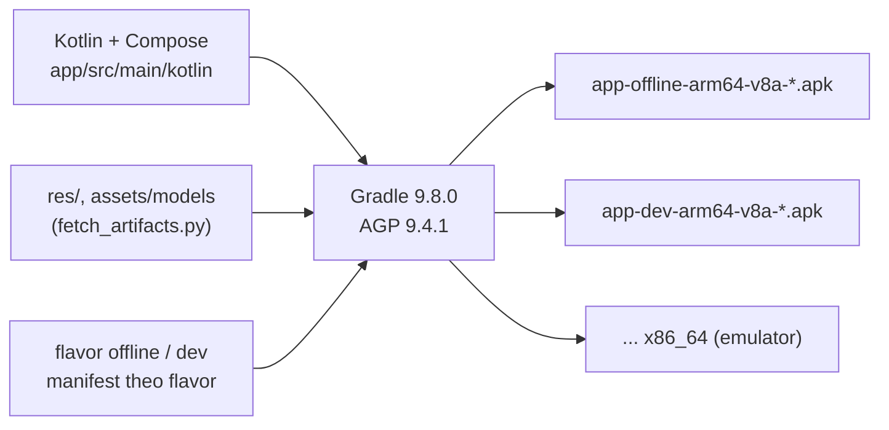

# DR-01 — Nền tảng app

**Trạng thái:** đã chốt · **Ngày:** 2026-10-01 · **Người viết:** Đạt (Claude soạn) ·
**Liên quan:** mốc M0, M1; `app/build.gradle.kts`, `gradle/libs.versions.toml`,
`docs/setup_windows.md`

## 1. Bối cảnh & ràng buộc

App cần chạy **offline hoàn toàn** trên điện thoại Android khoảng 4 GB RAM,
nạp model STT/TTS/MT trong tiến trình app và đo được độ trễ, RAM, dung lượng
(sơ đồ Phase 04/05 của Core). Sketch yêu cầu giao diện dùng được trên nhiều loại
máy và độ phân giải, không hardcode cho một máy. Nhóm có một người làm app;
người đó muốn nhận APK để cài, chưa cần tự mở IDE.

## 2. Định nghĩa

- **Native Android:** app viết bằng ngôn ngữ và SDK của Android, chạy trực tiếp
  trên ART, gọi được thư viện C/C++ qua JNI (sherpa-onnx, ONNX Runtime).
- **Jetpack Compose:** bộ UI khai báo (declarative) của Android: giao diện là hàm
  Kotlin vẽ lại theo state, thay cho layout XML.
- **Gradle + Android Gradle Plugin (AGP):** công cụ build; biến mã nguồn,
  resource và asset thành APK.
- **Product flavor:** các biến thể build từ cùng mã nguồn; ở đây `offline` (không
  quyền Internet) và `dev` (thêm ML Kit từ M5).
- **ABI split:** mỗi kiến trúc CPU một APK riêng, để APK không mang thư viện
  native của kiến trúc khác.

## 3. Quy trình hoạt động

Khi chạy: `MainActivity` → `VttTheme` → `VttApp` (NavigationSuiteScaffold: thanh
dưới trên điện thoại, rail trên màn rộng) → 5 màn + Hướng dẫn. `AppContainer`
giữ các thành phần dùng chung (DI thủ công).

## 4. Ứng viên

| Ứng viên | Ngôn ngữ | Gọi runtime native | Ghi chú |
|---|---|---|---|
| **Kotlin + Jetpack Compose** | Kotlin | Trực tiếp (AAR sherpa-onnx, ONNX Runtime có API Kotlin/Java) | Chính chủ Google; Compose có sẵn layout thích ứng theo cỡ màn hình [1][2] |
| Flutter | Dart | Qua plugin/FFI (có plugin `sherpa_onnx` [3]) | Thêm một lớp cầu nối; khó gắn số đo RAM cho đúng tiến trình |
| React Native | JS/TS | Qua native module | Nặng hơn trên máy yếu; cần tự viết cầu nối cho model |

## 5. Tiêu chí

1. Chạy model offline trong tiến trình app, ít lớp trung gian (Phase 05).
2. Đo được thời gian, RAM của chính app (Phase 04/05).
3. Giao diện thích ứng nhiều cỡ màn hình (sketch).
4. Dễ học, tài liệu nhiều, phù hợp đồ án một người làm app.
5. Build được bằng dòng lệnh để giao APK khi chưa cài IDE.

## 6. Ứng viên được chọn

**Kotlin + Jetpack Compose**, một module Gradle `:app` (đã chốt với người dùng
ngày 2026-09-30).

## 7. Lý do chọn & thiết kế tích hợp

Theo tiêu chí: (1) sherpa-onnx và ONNX Runtime có API Kotlin, gọi trực tiếp;
(2) model chạy trong tiến trình app nên PSS/RSS đo được bằng API Android;
(3) `NavigationSuiteScaffold` tự đổi thanh dưới/rail theo cỡ cửa sổ, chỉ dùng
dp/sp; (4) là hướng chính thức của Google; (5) Gradle wrapper chạy không cần IDE.

| Mục | Giá trị |
|---|---|
| Package | `vn.viettechtrans.app` (bản dev: `vn.viettechtrans.app.dev`, cài song song được) |
| SDK | minSdk 26 (Android 8.0), targetSdk 36, compileSdk 37 |
| Phiên bản (mới nhất ổn định ngày 2026-09-30) | AGP 9.4.1 (Kotlin tích hợp sẵn trong AGP 9), Gradle 9.8.0 (wrapper có `distributionSha256Sum`), Kotlin 2.4.20, Compose BOM 2026.09.00; ghim trong `gradle/libs.versions.toml` |
| Flavor | `offline`: `src/offline/AndroidManifest.xml` xoá INTERNET và ACCESS_NETWORK_STATE; `dev`: chỉ thêm ML Kit ở M5 |
| ABI | `arm64-v8a`, `x86_64` (split, không có APK universal); chọn bằng `-Pvtt.abis=...`; không hỗ trợ 32-bit |
| Đóng gói | Model nén trong APK (bỏ `noCompress` ngày 2026-10-01: −35 MB, giải nén khi nạp); release: R8 + keep rule sherpa-onnx, ký bằng debug key (APK cài tay cho đồ án), `profileable` để đo trên máy thật |
| Truy vết | `BuildConfig.GIT_SHA`, `GIT_DIRTY`, `OFFLINE_BUILD`; hiện ở Cài đặt → Giới thiệu |
| DI | Thủ công (`AppContainer`); không dùng Hilt/Dagger cho app một module |
| Icon | Material Symbols (Apache-2.0) dạng vector trong `res/drawable`; không dùng `material-icons-extended` (rất lớn) |
| Công cụ trên máy dev | Temurin JDK 21.0.12.1, Android SDK cmdline-tools 23.0, platform android-37.0, build-tools 37.0.0 (AGP tự thêm 36.0.0); không cần Android Studio (xem `docs/setup_windows.md`) |

## 8. Ưu điểm

- Gọi thẳng runtime native, không có lớp cầu nối.
- Đo tài nguyên đúng tiến trình app.
- Một mã nguồn cho mọi cỡ màn hình, có preview và test UI trên JVM (Robolectric).
- Build và test hoàn toàn bằng dòng lệnh.

## 9. Nhược điểm & rủi ro

| Rủi ro | Cách giảm / phát hiện |
|---|---|
| Chỉ chạy Android (không có iOS) | Ngoài phạm vi đồ án |
| APK lớn (~250 MB vì model nằm trong APK) | Ghi thành giới hạn; model int8; đo bằng `check_apk.py` (M2) |
| Không hỗ trợ máy 32-bit | Ghi thành giới hạn; máy 4 GB RAM phổ biến đều là arm64 |
| AGP 9 còn mới (Kotlin tích hợp, DSL mới); Gradle báo "deprecated features… incompatible with Gradle 10" | Ghim phiên bản; theo dõi cảnh báo bằng `--warning-mode all` khi nâng cấp |
| Windows Application Control trên máy dev chặn DLL giải nén vào `%TEMP%` (đã gặp với Conscrypt của Robolectric) | Tắt Conscrypt trong test (`@ConscryptMode(OFF)`); nếu gặp lại với DLL khác thì ghi vào đây |
| Ký bằng debug key | Chỉ dùng cài tay cho đồ án; không đưa lên Play |

## 10. Kiểm chứng

- `gradlew.bat test assembleOfflineDebug assembleDevDebug "-Pvtt.abis=arm64-v8a"`
  → BUILD SUCCESSFUL (2026-10-01).
- Test JVM: 22/22 cho mỗi flavor debug — `mt/` (DirectionTest 2,
  MtInputNormalizerParityTest 5 với 544 ca parity từ Core, MtPackageManifestTest 8,
  OutputPrefixStripperTest 4) và `ui/AppSmokeTest` 3 (Robolectric: mở đủ 5 màn,
  nút "?" mở Hướng dẫn, Cài đặt báo chưa có gói MT, hai nút chọn chiều).
- `aapt2 dump permissions`: APK `offline` chỉ có `RECORD_AUDIO` (không có
  INTERNET); package khác nhau giữa `offline` và `dev`; minSdk 26, targetSdk 36,
  native-code `arm64-v8a`.
- Chưa chạy trên máy thật (chờ người dùng cài APK) — ghi kết quả vào đây khi có.

## 11. Nguồn

1. Jetpack Compose — <https://developer.android.com/compose>
2. Adaptive navigation (NavigationSuiteScaffold) — <https://developer.android.com/develop/ui/compose/layouts/adaptive/build-adaptive-navigation>
3. sherpa-onnx (Kotlin API, plugin Flutter) — <https://github.com/k2-fsa/sherpa-onnx>
4. Material Symbols (Apache-2.0) — <https://github.com/google/material-design-icons>
