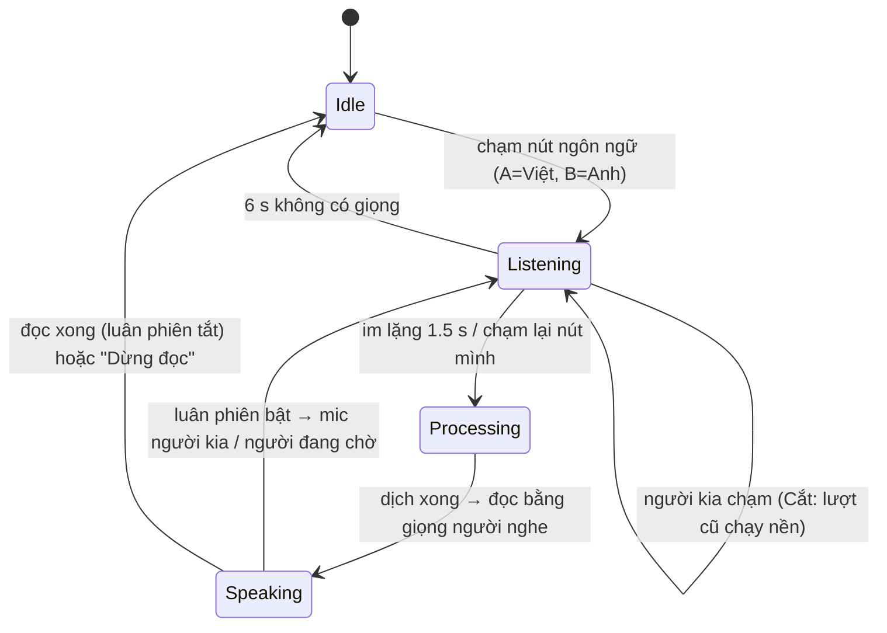

# DR-05 — Hội thoại hai người và chen lời

**Trạng thái:** đã chốt · **Ngày:** 2026-10-02 · **Người viết:** Đạt (Claude soạn) ·
**Liên quan:** mốc M6; `turn/ConversationReducer.kt`, `turn/TurnRunner.kt`,
`ui/conversation/*`, DR-03 (STT), DR-04 (TTS)

## 1. Bối cảnh & ràng buộc

- Mục đích chính trong sketch là "2 đứa nói chuyện". Bản đầu bắt hai người
  chuyển tab chiều dịch Việt→Anh / Anh→Việt mỗi lượt; người dùng thử thấy không
  tiện (2026-10-02).
- Không tự nhận diện ngôn ngữ (đã chốt): mỗi lượt nói phải gắn sẵn một ngôn ngữ.
- Một micro không tách được hai giọng nói chồng (sketch "chen 1"); cần quy tắc
  lượt nói cho "chen 2" (ngắt ngang) và "chen 3" (chờ nói xong).
- Chạy offline, máy khoảng 4 GB RAM; giao diện tiếng Việt, nửa của người nói
  tiếng Anh dùng chữ tiếng Anh.

## 2. Định nghĩa

- **Lượt (turn):** một lần một người nói hoặc gõ: nghe → nhận dạng → dịch → đọc.
- **Half-duplex:** tại một thời điểm chỉ mic mở hoặc loa đọc, không cùng lúc
  (tránh app nghe lại giọng đọc của chính nó).
- **Luân phiên tự động:** đọc xong bản dịch lượt của người này thì tự mở mic cho
  người kia, không cần chạm.
- **Cắt / Chờ:** khi người kia chạm nút trong lúc lượt hiện tại chưa xong: *Cắt*
  ngắt lượt hiện tại (vẫn nhận dạng, dịch, lưu nhưng không đọc); *Chờ* xếp hàng
  người chạm, mở mic cho họ khi lượt hiện tại xong.

## 3. Quy trình hoạt động

Reducer thuần (`ConversationReducer.reduce(state, event, cfg)`) quyết định;
`ConversationViewModel` chạy các effect (nghe, dịch, đọc) qua `TurnRunner`.
Sự kiện đến muộn (id lượt/đọc không khớp) bị bỏ qua.

## 4. Ứng viên (cách các app dịch làm, tra 2026-10-02)

| App | Bố cục | Chọn ngôn ngữ của lượt | Bắt đầu/kết thúc lượt | Ghi chú [nguồn] |
|---|---|---|---|---|
| Google Translate | Khung chat; nút chia đôi xoay nửa trên | Auto (tự nhận diện) hoặc 2 mic theo ngôn ngữ | Chạm, tự dừng khi im lặng | Auto playback bật/tắt; Live translate offline chỉ Pixel, không có tiếng Việt [1][2] |
| Microsoft Translator | Chia đôi, nửa trên xoay | Mic theo ngôn ngữ (hoặc mic luôn bật tự nhận diện) | Giữ để nói | Tự đọc; chậm/rất chậm; nói chuyện không chạy offline [3] |
| Naver Papago | Chia đôi | Mic theo ngôn ngữ mỗi nửa | Chạm | Chỉ hiện câu hiện tại; lịch sử ở thanh bên [4] |
| Samsung Interpreter | Nửa dưới mình, nửa trên người kia (xoay) | Mic theo ngôn ngữ | Chạm; tắt "Tap to talk" thì **tự mở mic người kia** khi người này nói xong | Offline, có tiếng Việt; One UI 8 thêm gõ chữ [5] |
| Apple Translate | Bong bóng; Face to Face / Side by Side | 2 mic khi tắt Detect Language | Auto Translate tự phát hiện bắt đầu/kết thúc | Chế độ toàn màn hình bản dịch; có ô gõ [6] |

## 5. Tiêu chí

1. Không phải đổi chiều thủ công giữa các lượt.
2. Không cần tự nhận diện ngôn ngữ.
3. Dùng được cả khi đặt máy giữa hai người lẫn khi ngồi đối diện.
4. Xử lý được chen lời theo sketch (chen 2, chen 3) và không để app nghe lại
   giọng đọc của chính nó.
5. Nhẹ: không tạo thêm model hay luồng xử lý so với màn Dịch.

## 6. Ứng viên được chọn

Màn **Hội thoại** (tab đầu) có hai kiểu, chuyển bằng nút trên thanh tiêu đề:

- **Khung chat** (mặc định, như Google/Apple): bong bóng Việt bên trái, Anh bên
  phải; dưới cùng 🎤 Tiếng Việt · ⌨ · 🎤 English.
- **Chia đôi đối diện** (như Papago/Microsoft/Samsung): nửa trên (English) xoay
  180°, mỗi nửa hiện to bản dịch câu người kia vừa nói.

Cộng thêm: **luân phiên tự động** (công tắc, mặc định tắt — cách Samsung thay cho
tự nhận diện), quy tắc **Cắt/Chờ** (chip), gõ chữ qua bottom sheet với hai nút
"Gửi tiếng Việt"/"Send English". Màn Dịch giữ cho dịch một mình, hai tab đổi
thành thanh "[nguồn] ⇄ [đích]".

## 7. Lý do chọn & thiết kế tích hợp

- Mỗi nút gắn một ngôn ngữ → đạt tiêu chí 1–2 mà không cần model nhận diện.
- Hai bố cục dùng chung một reducer và một ViewModel → tiêu chí 3, 5.
- Reducer thuần, test được trên JVM; bất biến kiểm bằng fuzz 10 000 chuỗi sự
  kiện: mic chỉ mở sau `StopSpeak`; lượt bị cắt không bao giờ được đọc; mỗi lượt
  đọc tối đa một lần; người đang chờ khác người đang nghe.
- Model: màn Hội thoại giữ 4 model (STT VI/EN, TTS VI/EN) qua
  `SpeechEngines.retainOnly`, nạp nền khi màn hiện ra; màn Dịch giữ 2 model của
  chiều đang chọn.
- Tham số khởi điểm: im lặng kết thúc lượt 1.5 s, không có giọng 6 s (lượt mở tự
  động thì dừng luân phiên, không báo lỗi), lượt tối đa 60 s.
- Lựa chọn bố cục, luân phiên, Cắt/Chờ, xoay nửa trên lưu trong
  SharedPreferences `conversation`. Tin nhắn hiện giữ trong RAM; lưu Room ở M7.

## 8. Ưu điểm

- Không còn đổi tab; hai người chỉ chạm nút ngôn ngữ của mình (hoặc không chạm
  gì khi bật luân phiên).
- Theo mẫu quen thuộc của các app lớn, dễ dùng ngay.
- Chen lời có quy tắc rõ, đúng hai trường hợp trong sketch.

## 9. Nhược điểm & rủi ro

| Rủi ro | Cách giảm / phát hiện |
|---|---|
| Nói chồng (chen 1) vẫn lẫn vào lượt đang mở | Ghi rõ trong Hướng dẫn; đo ở TN-04 |
| Luân phiên mở mic khi người kia chưa muốn nói | Mặc định tắt; 6 s im lặng thì dừng, không báo lỗi |
| RAM khi giữ 4 model | Đo trên AVD 2 GB: PSS 515 MB (dev, có ML Kit) không bị đóng; máy thật đo lại; `onTrimMemory` giải phóng |
| Nửa trên xoay làm người cầm máy khó đọc | Chip "Xoay nửa trên" tắt được; màn ngang không xoay |

## 10. Kiểm chứng

- `ConversationReducerTest`: 14 test (lượt đầy đủ, chạm lại nút mình, Cắt khi
  đang nghe, Chờ và huỷ chờ, chạm khi đang đọc, luân phiên, dừng tay, im lặng,
  không có bộ dịch, sự kiện cũ, gõ khi người khác đang nói, nghe lại, fuzz 10k).
- `AppSmokeTest`: màn Hội thoại là màn đầu, có hai nút ngôn ngữ, chuyển bố cục;
  màn Dịch đảo chiều bằng ⇄.
- Emulator Pixel_10a (API 37, 2 GB, x86_64, bản devDebug): gõ "My laptop cannot
  connect to the wifi" → bong bóng phải, bản dịch tiếng Việt, đọc giọng Việt
  (MT 719 ms, TTS 570 ms, tổng 1289 ms); gõ một câu tiếng Việt → đọc tiếng Anh;
  kiểu chia đôi hiển thị đúng, nửa trên xoay; không có lỗi văng.
- Chưa kiểm: hai người nói bằng mic thật, luân phiên và Cắt/Chờ bằng giọng —
  người dùng thử trên máy (ghi kết quả vào đây).

## 11. Nguồn

1. Google Translate Help, Conversation — <https://support.google.com/translate/answer/6142474?hl=en&co=GENIE.Platform%3DAndroid>
2. 9to5Google (2024, 2025) — <https://9to5google.com/2024/02/01/google-translate-conversation-redesign/>, <https://9to5google.com/2025/08/26/google-translate-ai/>
3. Microsoft Translator Android FAQ — <https://www.microsoft.com/en-us/translator/help/android/>
4. Papago (blog du lịch, không phải tài liệu chính thức) — <https://inmykorea.com/papago-app-translate-korean-in-korea/>
5. Samsung Interpreter — <https://www.samsung.com/latin_en/support/mobile-devices/how-to-set-up-and-use-the-interpreter-app-on-the-galaxy-s24/>
6. Apple Translate — <https://www.macrumors.com/how-to/use-conversation-mode-translate-app/>
